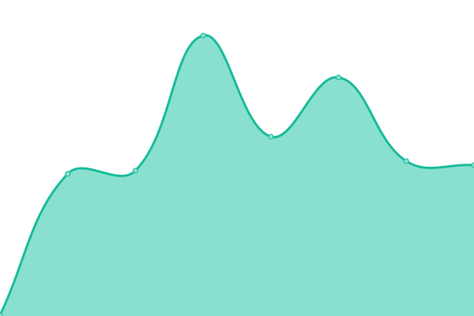

# [📈 Live Status](https://20xlevel.github.io/upptime): <!--live status--> **🟧 Partial outage**

This repository contains the open-source uptime monitor and status page for [20xlevel](https://20xlevel.github.io/upptime), powered by [Upptime](https://github.com/upptime/upptime).

With [Upptime](https://upptime.js.org), you can get your own unlimited and free uptime monitor and status page, powered entirely by a GitHub repository. We use [Issues](https://github.com/20xlevel/upptime/issues) as incident reports, [Actions](https://github.com/20xlevel/upptime/actions) as uptime monitors, and [Pages](https://20xlevel.github.io/upptime) for the status page.

<!--start: status pages-->
<!-- This summary is generated by Upptime (https://github.com/upptime/upptime) -->
<!-- Do not edit this manually, your changes will be overwritten -->
<!-- prettier-ignore -->
| URL | Status | History | Response Time | Uptime |
| --- | ------ | ------- | ------------- | ------ |
|  [Price API](https://api.level.finance/health) | 🟩 Up | [price-api.yml](https://github.com/20xlevel/upptime/commits/HEAD/history/price-api.yml) | 

 780ms
     
 | 

<a href="https://20xlevel.github.io/upptime/history/price-api">96.69%</a>
    

|  [BSC keeper balance](https://keeper-mainnet.herokuapp.com/health/executor) | 🟩 Up | [bsc-keeper-balance.yml](https://github.com/20xlevel/upptime/commits/HEAD/history/bsc-keeper-balance.yml) | 

 556ms
     
 | 

<a href="https://20xlevel.github.io/upptime/history/bsc-keeper-balance">99.79%</a>
    

|  [BSC price feed](https://keeper-mainnet.herokuapp.com/health/price-feed) | 🟩 Up | [bsc-price-feed.yml](https://github.com/20xlevel/upptime/commits/HEAD/history/bsc-price-feed.yml) | 

 222ms
     
 | 

<a href="https://20xlevel.github.io/upptime/history/bsc-price-feed">99.79%</a>
    

|  [BSC farm fund](https://keeper-mainnet.herokuapp.com/health/level-master) | 🟩 Up | [bsc-farm-fund.yml](https://github.com/20xlevel/upptime/commits/HEAD/history/bsc-farm-fund.yml) | 

 122ms
     
 | 

<a href="https://20xlevel.github.io/upptime/history/bsc-farm-fund">99.79%</a>
    

|  [AR balance](https://api.level.finance/health/arbalance) | 🟥 Down | [ar-balance.yml](https://github.com/20xlevel/upptime/commits/HEAD/history/ar-balance.yml) | 

 557ms
     
 | 

<a href="https://20xlevel.github.io/upptime/history/ar-balance">96.09%</a>
    

|  [Order expire rate](https://keeper-mainnet.herokuapp.com/health/expire-rate) | 🟩 Up | [order-expire-rate.yml](https://github.com/20xlevel/upptime/commits/HEAD/history/order-expire-rate.yml) | 

 244ms
     
 | 

<a href="https://20xlevel.github.io/upptime/history/order-expire-rate">99.67%</a>
    

|  [Terminal API](https://terminal.level.finance/v4/health) | 🟩 Up | [terminal-api.yml](https://github.com/20xlevel/upptime/commits/HEAD/history/terminal-api.yml) | 

 612ms
     
 | 

<a href="https://20xlevel.github.io/upptime/history/terminal-api">99.48%</a>
    

|  [Terminal Worker](https://terminal.level.finance/v4/worker/health) | 🟩 Up | [terminal-worker.yml](https://github.com/20xlevel/upptime/commits/HEAD/history/terminal-worker.yml) | 

 154ms
     
 | 

<a href="https://20xlevel.github.io/upptime/history/terminal-worker">99.48%</a>
    

<!--end: status pages-->

[**Visit our status website →**](https://20xlevel.github.io/upptime)

## 📄 License

- Powered by: [Upptime](https://github.com/upptime/upptime)
- Code: [MIT](./LICENSE) © [20xlevel](https://20xlevel.github.io/upptime)
- Data in the `./history` directory: [Open Database License](https://opendatacommons.org/licenses/odbl/1-0/)
