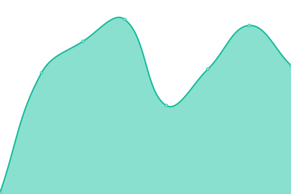

# [📈 Live Status](https://20xlevel.github.io/upptime): <!--live status--> **🟥 Complete outage**

This repository contains the open-source uptime monitor and status page for [20xlevel](https://20xlevel.github.io/upptime), powered by [Upptime](https://github.com/upptime/upptime).

With [Upptime](https://upptime.js.org), you can get your own unlimited and free uptime monitor and status page, powered entirely by a GitHub repository. We use [Issues](https://github.com/20xlevel/upptime/issues) as incident reports, [Actions](https://github.com/20xlevel/upptime/actions) as uptime monitors, and [Pages](https://20xlevel.github.io/upptime) for the status page.

<!--start: status pages-->
<!-- This summary is generated by Upptime (https://github.com/upptime/upptime) -->
<!-- Do not edit this manually, your changes will be overwritten -->
<!-- prettier-ignore -->
| URL | Status | History | Response Time | Uptime |
| --- | ------ | ------- | ------------- | ------ |
|  [Price API](https://api.level.finance/health) | 🟥 Down | [price-api.yml](https://github.com/20xlevel/upptime/commits/HEAD/history/price-api.yml) | 

 597ms
     
 | 

<a href="https://20xlevel.github.io/upptime/history/price-api">100.00%</a>
    

|  [BSC keeper balance](https://keeper-mainnet.herokuapp.com/health/executor) | 🟥 Down | [bsc-keeper-balance.yml](https://github.com/20xlevel/upptime/commits/HEAD/history/bsc-keeper-balance.yml) | 

 533ms
     
 | 

<a href="https://20xlevel.github.io/upptime/history/bsc-keeper-balance">88.10%</a>
    

|  [BSC price feed](https://keeper-mainnet.herokuapp.com/health/price-feed) | 🟥 Down | [bsc-price-feed.yml](https://github.com/20xlevel/upptime/commits/HEAD/history/bsc-price-feed.yml) | 

 172ms
     
 | 

<a href="https://20xlevel.github.io/upptime/history/bsc-price-feed">98.35%</a>
    

|  [BSC farm fund](https://keeper-mainnet.herokuapp.com/health/level-master) | 🟥 Down | [bsc-farm-fund.yml](https://github.com/20xlevel/upptime/commits/HEAD/history/bsc-farm-fund.yml) | 

 142ms
     
 | 

<a href="https://20xlevel.github.io/upptime/history/bsc-farm-fund">99.64%</a>
    

|  [AR balance](https://api.level.finance/health/arbalance) | 🟥 Down | [ar-balance.yml](https://github.com/20xlevel/upptime/commits/HEAD/history/ar-balance.yml) | 

 364ms
     
 | 

<a href="https://20xlevel.github.io/upptime/history/ar-balance">100.00%</a>
    

|  [Testnet keeper balance](https://keeper-test-2.herokuapp.com/health/executor) | 🟥 Down | [testnet-keeper-balance.yml](https://github.com/20xlevel/upptime/commits/HEAD/history/testnet-keeper-balance.yml) | 

 660ms
     
 | 

<a href="https://20xlevel.github.io/upptime/history/testnet-keeper-balance">98.92%</a>
    

|  [Testnet price feed](https://keeper-test-2.herokuapp.com/health/price-feed) | 🟥 Down | [testnet-price-feed.yml](https://github.com/20xlevel/upptime/commits/HEAD/history/testnet-price-feed.yml) | 

 214ms
     
 | 

<a href="https://20xlevel.github.io/upptime/history/testnet-price-feed">75.75%</a>
    

|  [Testnet farm fund](https://keeper-test-2.herokuapp.com/health/level-master) | 🟥 Down | [testnet-farm-fund.yml](https://github.com/20xlevel/upptime/commits/HEAD/history/testnet-farm-fund.yml) | 

 231ms
     
 | 

<a href="https://20xlevel.github.io/upptime/history/testnet-farm-fund">0.00%</a>
    

<!--end: status pages-->

[**Visit our status website →**](https://20xlevel.github.io/upptime)

## 📄 License

- Powered by: [Upptime](https://github.com/upptime/upptime)
- Code: [MIT](./LICENSE) © [20xlevel](https://20xlevel.github.io/upptime)
- Data in the `./history` directory: [Open Database License](https://opendatacommons.org/licenses/odbl/1-0/)
